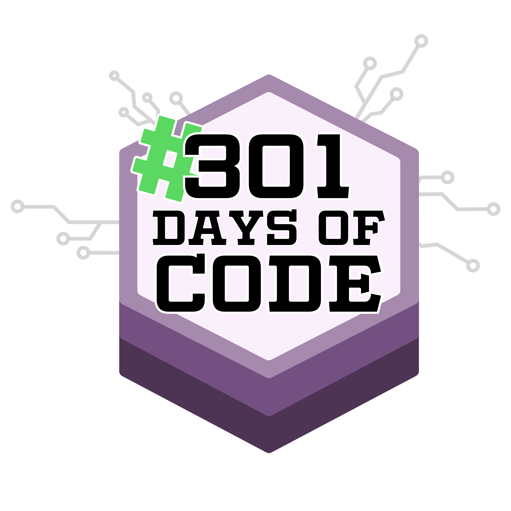
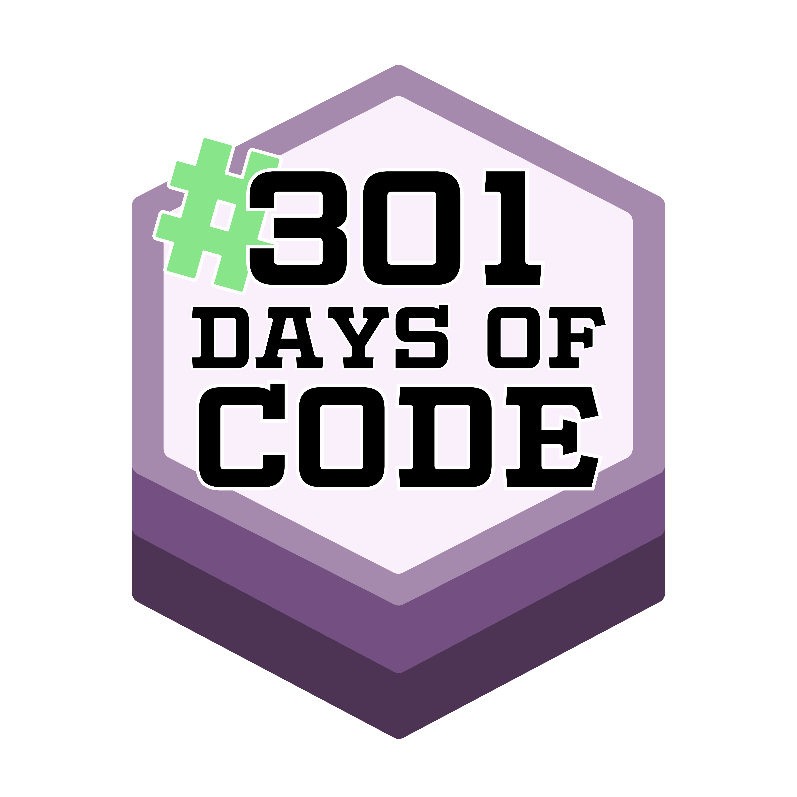

Note: this is only a test to think about if, what, how, etc something like this is 
doable.

example->

# Awesome 301DaysOfCode

This is the awesome list of people participating to 301DaysOfCode and relative 
resources (books, courses, tutorials, readings, metodologies, experiences, sections, etc) that participants found useful and are willing to share.

## TL;DR
- Community: list of participants and how to add yourself to the [community](#community)
- Contribution: willing to? Please read the [contribution guide](#contribution-guide)

## Contents

- [Contribution guide](#contribution-guide)

- [Community](#community)
    - [Starters](#starters)

[//]: # (Inspirations)

- [Resources](#resources)
    - [Learning resources](#learning-resources)
    - [Templates](#templates)

## Contribution guide

Want to contribute resources that you find useful (books, courses, tutorials, 
readings, metodologies, experiences, sections, etc)? 
Check the [contribution guide](.github/contributing.md)

## Community

Check the list of participants in the [community](community/community.md) and the 
[how to add yourself](.github/community-how-to-add-yourself.md) pages.

### Starters
- Benjamin Spak [about](http://benjaminspak.com/)
 | [301-days-code](http://benjaminspak.com/challenges/301-days-code/)
 | [twitter](https://twitter.com/benjaminspak)
 | [github](https://github.com/benjaminspak)

## Resources

## Learning resources
- [Learn](learn/learn.md)

### Templates
- [Template for the 301 Days journal](https://github.com/akshay1337/301-Days-Of-Code)

# License

* Distributed under the MIT license. See LICENSE for more information.

